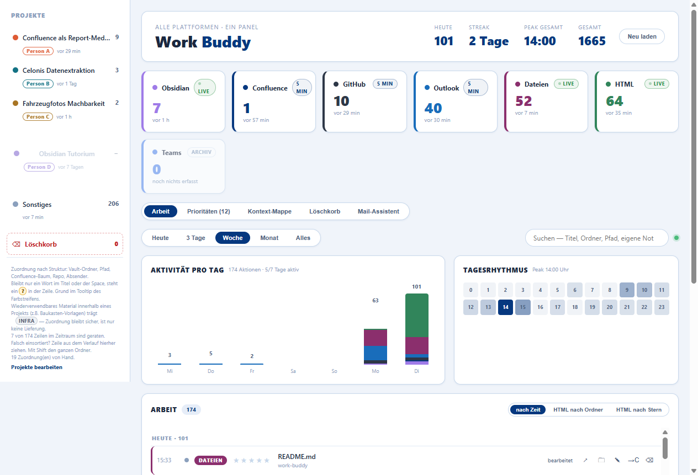
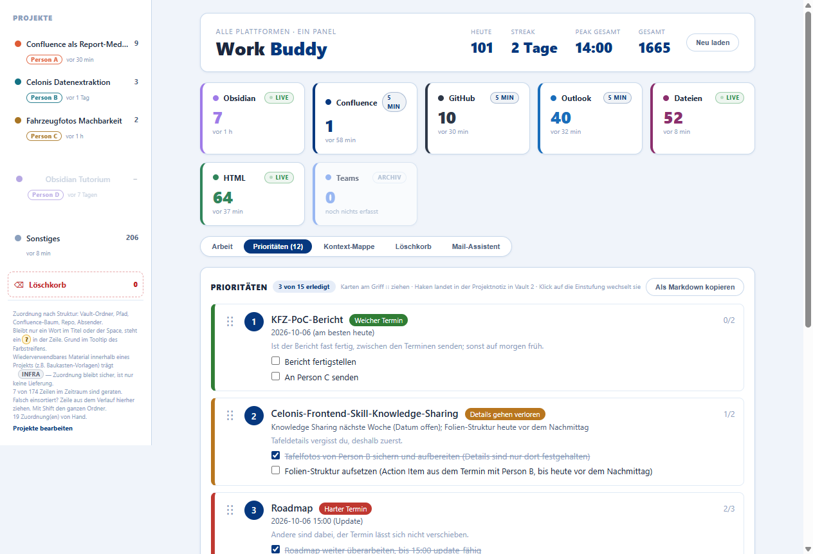
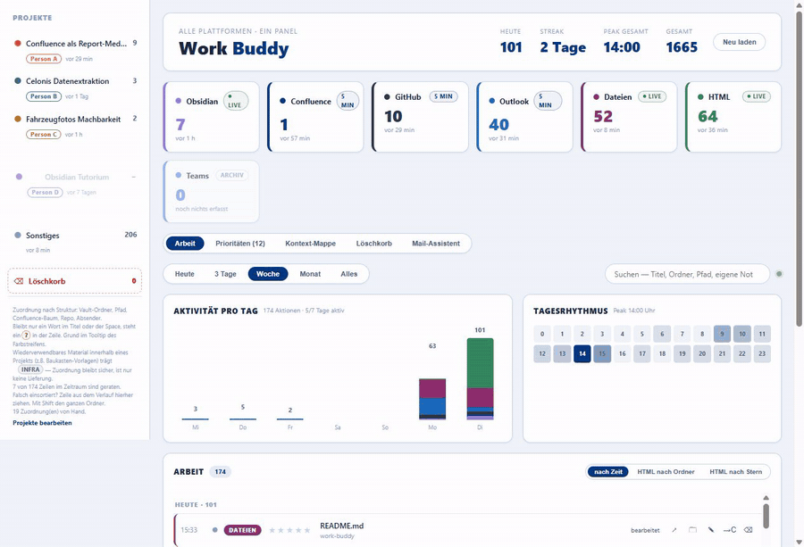
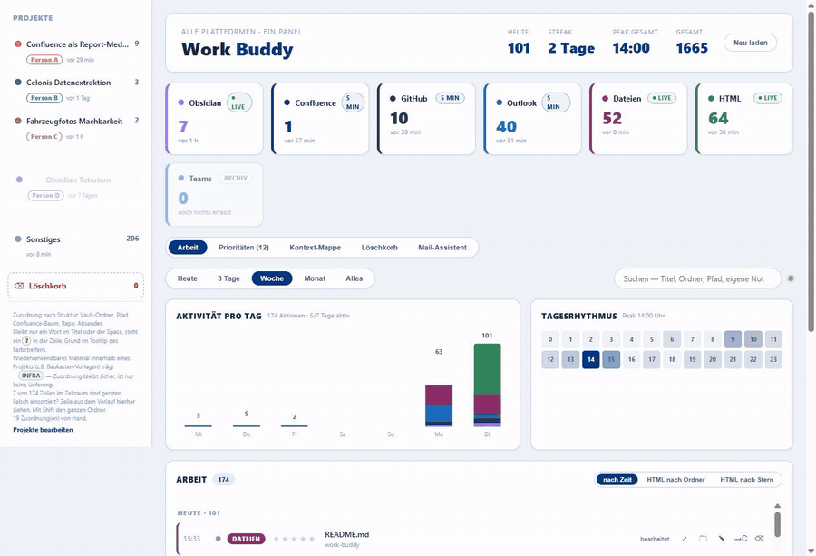
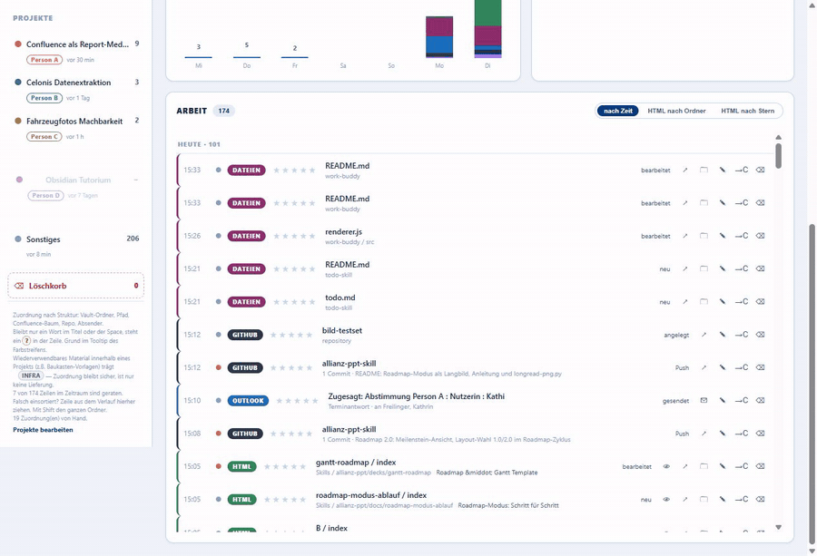
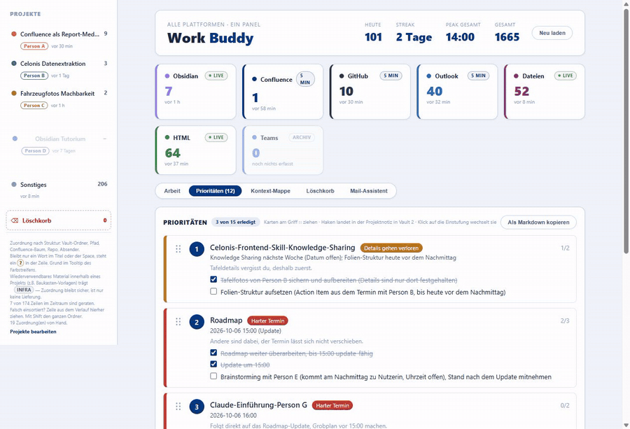
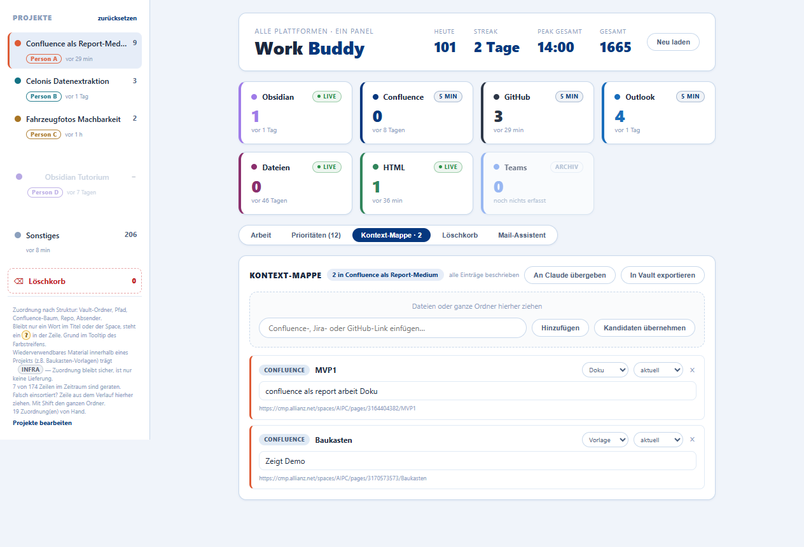

<div align="center">

# Work Buddy
## Ein lokales Panel für die eigene Arbeit über sechs Plattformen hinweg

> "Wo lag das noch mal? Und war das für Kollege A oder für Kollegin B?"

[](#warum-es-das-gibt)
[](./LICENSE)
[](#loslegen)
[](#mcp-server-ziehen-statt-schieben)
[](#wie-es-funktioniert)

<p>
  <a href="#quick-install">Install</a> ·
  <a href="#features">Features</a> ·
  <a href="#loslegen">Anleitung</a> ·
  <a href="#wie-es-funktioniert">Wie es funktioniert</a> ·
  <a href="#zuordnung-struktur-schlägt-wort">Zuordnung</a> ·
  <a href="#mcp-server-ziehen-statt-schieben">MCP-Server</a> ·
  <a href="#faq">FAQ</a>
</p>

</div>

<table align="center">
  <tr>
    <td width="50%" align="center" valign="top">
      
      <br /><sub><b>Zeitleiste</b> — sechs Quellen, jede Zeile mit Grund für ihr Projekt</sub>
    </td>
    <td width="50%" align="center" valign="top">
      
      <br /><sub><b>Prioritäten</b> — Karten ziehen, Haken landen in der Projektnotiz</sub>
    </td>
  </tr>
</table>

**Work Buddy liest, was auf diesem Rechner sowieso schon passiert (in Obsidian, Confluence, GitHub, Outlook und den verstreuten Arbeitsdateien) und baut daraus eine Zeitleiste, eine Projektzuordnung und eine Kontext-Mappe, die eine Claude-Code-Sitzung direkt lesen kann.** Es gibt nichts nachzutragen. Das Panel beobachtet nur, was ohnehin entsteht.

Jede Zuordnung trägt ihren Grund sichtbar in der Zeile. Ein Farbstreifen, der nur sagt *wo* etwas hängt, aber nicht *warum*, sieht wie ein Ergebnis aus, auch wenn er geraten hat. Das hat einmal eine ganze Woche fremder Arbeit unter dem falschen Namen liegen lassen. Seitdem hat jede Zeile einen Grund im Tooltip und jede Vermutung ein sichtbares `?`.

**Alles bleibt lokal.** Die Laufzeitdaten (`data/`) sind aus Git ausgeschlossen. Extern geht nur das Polling gegen Allianz-interne Confluence, GitHub Enterprise und Outlook. Zugangsdaten kommen aus `~/.mcp.json` bzw. dem lokalen Outlook-Profil, nie aus dem Code.

> Windows-primär. Die Outlook-Anbindung läuft über COM, die Pfade sind auf die `OneDrive - Allianz`-Struktur zugeschnitten. Voraussetzung: Node.js.

## Quick Install

```bash
git clone https://github.developer.allianz.io/yueou-li/work-buddy.git
cd work-buddy
npm install
npm start
```

Ein Electron-Fenster öffnet sich mit der Zeitleiste (Voreinstellung: Woche, umschaltbar auf Heute, 3 Tage, Monat, Alles). Für Historie siehe [Erstbefüllung](#3-erstbefüllung-mit-seedpy).

## Features

| Bereich | Was es tut |
|---|---|
| **Sechs Quellen** | Obsidian, Arbeitsdateien unter `Dokumente\Claude` und verstreute HTML-Artefakte per Live-Watcher; Confluence, GitHub und Outlook per Poll alle 5 Minuten |
| **Zeitleiste** | Aktivität pro Tag, Tagesrhythmus mit Peak-Stunde, Streak. Massenläufe (z. B. `git checkout` über 50 Dateien) werden zu einer Batch-Zeile gefaltet |
| **Projektzuordnung mit Begründung** | Jede Zeile zeigt, *warum* sie bei einem Projekt hängt: Vault-Ordner, Pfadfragment, Confluence-Zweig, Repo oder Absender. Ein Wort im Titel oder ein Space ist nur eine Vermutung und bekommt ein `?` |
| **Prioritäten** | Offene Aufgaben aus den Projektnotizen in Obsidian Vault 2, als Karten zum Sortieren. Einstufung (harter Termin, Details gehen verloren, weicher Termin, verschiebbar) mit Grund. Ein Haken im Panel schreibt `- [x]` in die Notiz |
| **HTML-Ablage** | Findet jede HTML-Datei auf dem Rechner wieder: Vollscan plus Log, nach Ordner-Schublade sortiert, mit Sternen und eigener Notiz |
| **Kontext-Mappe** | Kuratierte Liste je Projekt: was gehört dazu, in welcher Rolle (Auftrag, Quelle, Prototyp, Vorlage, Doku, Referenz), welcher Stand. Export in den Obsidian-Vault |
| **Löschkorb** | Zwei Stufen: erst in den Vault-Papierkorb, auf Wunsch dann in den Windows-Papierkorb. Nie `unlink`, jeder Fehlgriff bleibt umkehrbar |
| **Mail-Assistent** | Kontext, deutscher Entwurf und die eigentliche Absicht (auch auf Chinesisch) gehen rein, eine finale deutsche Fassung kommt raus. Die Korrekturen landen im Fehlertagebuch |
| **Übergabe an Claude (Schieben)** | Ein Klick schreibt den Kontext einer Zeile nach `data/auftrag.md` und legt einen Einfüge-Satz in die Zwischenablage, mit einer Marke, die eine veraltete Übergabe erkennt |
| **MCP-Server (Ziehen)** | Fünf read-only Werkzeuge, mit denen eine laufende Claude-Sitzung selbst nachfragt, ohne vorherigen Klick im Panel |
| **Diagnose** | `tools/zuordnung-pruefen.js` zeigt, welche Regel wie oft trifft. Eine Regel mit auffällig vielen Treffern ist der nächste Fehler |

### Anwendungsbeispiele

<table align="center">
  <tr>
    <td width="25%" align="center" valign="top">
      
      <br /><sub><b>① Reiter</b><br/>Arbeit, Prioritäten, Mappe, Löschkorb, Mail</sub>
    </td>
    <td width="25%" align="center" valign="top">
      
      <br /><sub><b>② Projekt wählen</b><br/>Schiene links filtert die Zeitleiste</sub>
    </td>
    <td width="25%" align="center" valign="top">
      
      <br /><sub><b>③ HTML finden</b><br/>nach Zeit, Ordner oder Stern</sub>
    </td>
    <td width="25%" align="center" valign="top">
      
      <br /><sub><b>④ Priorisieren</b><br/>Griff ziehen, Haken setzen</sub>
    </td>
  </tr>
</table>

## Warum es das gibt

Aktivität lag an sechs Orten ohne gemeinsame Zeitleiste: eine Obsidian-Notiz von heute Morgen, ein Confluence-Kommentar von gestern, ein liegen gelassenes HTML-Deck von vor drei Monaten. *"Was habe ich diese Woche für wen gemacht"* ließ sich nur beantworten, indem man fünf Programme nacheinander aufmachte.

Work Buddy sammelt das ein, ohne dass jemand etwas nachträgt. Jede Quelle liefert, was sie ohnehin speichert. Die eigentliche Arbeit ist die Zuordnung: sechs Quellen auf vier Projekte zu bringen, ohne einen Container (einen Confluence-Space, einen Ordner) mit einer Kategorie zu verwechseln, sobald er einen zweiten Zweck bekommt. Genau das ist einmal schiefgegangen, siehe [Zuordnung](#zuordnung-struktur-schlägt-wort).

## Loslegen

### 1. Installieren und starten

```bash
git clone https://github.developer.allianz.io/yueou-li/work-buddy.git
cd work-buddy
npm install
npm start
```

Alternativ über `start.cmd`. Das Skript setzt `ELECTRON_RUN_AS_NODE` zurück, das Electron sonst aus einer geerbten Shell-Variable falsch startet.

<p align="center">
  
</p>

Die Schiene links zeigt die Projekte mit Ereigniszahl, der Löschkorb darunter nimmt Zeilen zum Wegräumen auf. Oben stehen die sieben Quellenkarten (Teams ist archiviert, siehe [Einschränkungen](#bekannte-einschränkungen)).

### 2. Projektregeln einrichten

`data/projects.json` überschreibt die Standardregeln aus `src/projects.js` vollständig, sobald die Datei existiert. Bei jeder Regeländerung also beide Stellen im Blick behalten. Änderungen an `data/` greifen sofort, die App beobachtet das Verzeichnis. Änderungen an `src/` brauchen einen Neustart.

Jedes Projekt hat zwei Klassen von Regeln:

| Klasse | Felder | Bedeutung |
|---|---|---|
| **Stark** (Struktur, gilt als sicher) | `folders`, `pfade`, `elternseiten`, `repos`, `mails` | Vault-Ordner, Pfadfragment, Confluence-Zweig, Repo-Name, Absenderadresse. Tatsachen über die Datei |
| **Schwach** (Indiz, wird als `?` markiert) | `keywords`, `spaces` | Ein Wort im Titel, ein Confluence-Space. Kann stimmen, ist aber nicht belegt |

Starke Regeln laufen zuerst, über alle Projekte. Erst danach kommen die schwachen. So entscheidet die Reihenfolge der Projektliste nie über richtig oder falsch.

Eine Zeile im falschen Projekt ziehst du auf das richtige in der Schiene (mit Shift für den ganzen Ordner).

<p align="center">
  
</p>

### 3. Erstbefüllung mit `seed.py`

Der Live-Betrieb sieht nur, was ab jetzt passiert. Für Historie:

```bash
python seed.py
```

Das Skript liest den Confluence-Token wie der Collector aus `~/.mcp.json` (kein Argument nötig), sammelt Confluence, GitHub und die letzten 14 Tage Obsidian und schreibt nach `data/events.jsonl`.

### 4. HTML-Dateien wiederfinden

Die Ablage hat drei Gruppierungen derselben Liste: nach Zeit, nach Ordner-Schublade und nach Stern. Es ist bewusst nur HTML. Notizen findet Obsidian, Seiten findet Confluence, verstreute HTML-Artefakte findet sonst niemand.

<p align="center">
  
</p>

### 5. Prioritäten setzen

Der Reiter **Prioritäten** liest alle Projektnotizen unter `Obsidian Vault 2\wiki\projects\<Projekt>\<Projekt>.md` und zeigt den Abschnitt `## Tasks` als Karten. Notizen ohne Aufgaben und solche mit `status: done` bleiben draußen.

- **Reihenfolge:** Karte am Griff `⋮⋮` ziehen. Gespeichert wird in `data/prioritaeten.json`.
- **Einstufung:** Klick auf das Etikett wechselt zwischen *Harter Termin*, *Details gehen verloren*, *Weicher Termin*, *Verschiebbar* und *Nicht eingestuft*. Das ist ein Urteil von dir und gehört nicht in die Notiz.
- **Abhaken:** Der Haken schreibt `- [x]` in die Zeile der Notiz und setzt `updated:` auf heute. Gefunden wird die Zeile über ihren Text, nicht über die Zeilennummer, weil die Notiz parallel in Obsidian offen sein kann.
- **Gegenrichtung:** Ändert ein anderer Prozess die Notiz (Obsidian, der Slash-Command `/todo`), lädt der Reiter selbst nach.
- **Export:** *Als Markdown kopieren* legt die Liste mit Reihenfolge und Haken in die Zwischenablage.

<p align="center">
  
</p>

Das Panel setzt `status: done` nicht selbst. Sonst verschwände die Karte beim letzten Haken.

### 6. MCP-Server in Claude Code registrieren

```bash
claude mcp add work-buddy -- node "<Repo-Pfad>/mcp/server.js"
```

Danach stehen die fünf `wb_*`-Werkzeuge in jeder Claude-Code-Sitzung bereit, siehe [unten](#mcp-server-ziehen-statt-schieben).

## Wie es funktioniert

```
Sechs Quellen                                      Work Buddy
  │                                                    │
  ├── Obsidian · Arbeitsdateien · HTML ── fs.watch ──→  │
  │                                                    ├──→ data/events.jsonl
  └── Confluence · GitHub · Outlook ── Poll (5 Min) ──→  │        │
                                                         │        ▼
                                          ┌──────────────┴── Zuordnung (stark → schwach)
                                          │                       │
                              ┌───────────┼───────────┐           │
                              ▼           ▼           ▼           ▼
                        📊 Zeitleiste  📁 Ablage  🗂 Kontext-Mappe  🗑 Löschkorb
                              │
                    ┌─────────┴─────────┐
                    ▼                   ▼
          📤 auftrag.js (Schieben)   🔌 mcp/server.js (Ziehen)
          Datei + Zwischenablage      5 read-only Werkzeuge

Vault 2 / wiki/projects/*.md ◄──► 🎯 Prioritäten  (liest Aufgaben, schreibt Haken)
```

**Zwei Sammelwege**, wie bei jedem Collector: Ein Watcher allein verpasst, was vor dem Programmstart lag. Ein periodischer Scan allein reagiert erst mit Verzögerung.

| Quelle | Modus | Warum |
|---|---|---|
| Obsidian | `fs.watch`, live | Vault-Änderungen sind sofort da, ein Poll wäre nur langsamer |
| Arbeitsdateien (`Dokumente\Claude`) | `fs.watch`, live | Dasselbe Argument. Projektordner ohne HTML kamen sonst im Panel gar nicht vor |
| HTML-Artefakte | `fs.watch` plus periodischer Vollscan | Der Watcher fängt Neues, der Scan holt nach, was vor dem ersten Start schon da lag |
| Confluence | Poll, 5 Min | REST-API, kein Push. Jeder Poll bringt die Ahnenkette der Seite mit (`expand=ancestors`), das kostet keine zusätzliche Abfrage |
| GitHub | Poll, 5 Min | `gh`-CLI, kein Webhook eingerichtet |
| Outlook | Poll, 5 Min | Ruft `outlook_activity.py` aus dem `outlook-context`-Skill auf: ein Werkzeug, eine Zählweise, keine zweite COM-Anbindung. Startet Outlook nie selbst (`--allow-start` ist aus) |

## Zuordnung: Struktur schlägt Wort

Die Zuordnung lief einmal einstufig: Die erste passende Regel in Listenreihenfolge gewann, und ein Confluence-Space zählte so viel wie ein Vault-Ordner. Das Ergebnis war nachweisbar falsch. Eine einzige Regel (`spaces: ["AIPC"]`, weil der Space bis zu einem Umbau tatsächlich ein Projekt war) hatte 53 fremde Confluence-Seiten einem falschen Auftraggeber zugeschlagen, 23 davon in einer Woche, in der an diesem Projekt gar nicht gearbeitet wurde. Ein Container (Space, Ordner, Postfach) taugt nicht als Merkmal für eine Kategorie, sobald er einen zweiten Zweck bekommt.

Deshalb läuft die Zuordnung jetzt zweistufig über alle Projekte:

1. **Erst alle starken Regeln.** Vault-Ordner (Präfix), Pfadfragment, Confluence-Zweig (Platz im Seitenbaum, nicht der Space), Repo-Name, Absenderadresse. Trifft eine, ist die Zeile eine Tatsache.
2. **Dann alle schwachen Regeln.** Ein Schlagwort im Titel, ein Confluence-Space. Trifft nur das, bekommt die Zeile ein `?`, sichtbar im Panel und nicht nur im Log.

Schlagworte prüfen nur den **Titel**, nie den Pfad. Bei den Quellen `html` und `arbeit` ist der Titel ein Dateiname und damit ein Stück Pfad. `keyword: "obsidian"` hätte sonst jede Datei unter `…/Obsidian Vault/…` getroffen.

```bash
node tools/zuordnung-pruefen.js              # Übersicht: jede Regel, Trefferzahl, Ratequote
node tools/zuordnung-pruefen.js <projekt-id>  # alle Zeilen eines Projekts mit Begründung
node tools/zuordnung-pruefen.js --geraten     # nur die Vermutungen
```

Der Fehler wäre damit in 30 Sekunden sichtbar gewesen, statt eine Woche unbemerkt zu bleiben.

## Kontext-Mappe: kuratiert, nicht abgeleitet

<p align="center">
  
  <br><sub>Jeder Eintrag: Rolle (Auftrag/Quelle/Prototyp/Vorlage/Doku/Referenz), Stand (aktuell/veraltet/ungeprüft), ein Satz wofür</sub>
</p>

Die Mappe enthält nur Verweise (Pfad oder Link) plus eine eigene Notiz, nie kopierten Text. Confluence bleibt führend, eine Kopie wäre ab dem nächsten Edit falsch. Die ganze Mappe eines Projekts geht mit einem Klick an Claude oder als Markdown in den Vault.

## MCP-Server: Ziehen statt Schieben

Der Übergabe-Knopf im Panel (`auftrag.js`) ist **Schieben**: Das Panel schreibt Kontext in eine Datei, du fügst den Einfüge-Satz in die laufende Sitzung ein. Der MCP-Server ist die Gegenrichtung, **Ziehen**: Die Sitzung fragt selbst, ohne dass vorher ein Klick im Panel nötig war.

Drei Entscheidungen prägen ihn:

- **Nur Lesen.** Kein Werkzeug ändert etwas, weder Mappe noch Bewertung noch Löschkorb.
- **Keine Abhängigkeit.** Der stdio-Teil von MCP ist zeilenweises JSON-RPC, ein `npm install` in einem zweiten Netz entfällt.
- **Dieselben Module wie das Panel.** `store`, `projects`, `library` und `dossier` werden requiriert, nicht nachgebaut. Ein zweiter Begriff von "welches Projekt" wäre genau der Fehler, den [die Zuordnung](#zuordnung-struktur-schlägt-wort) vermeidet.

| Werkzeug | Liefert |
|---|---|
| `wb_verlauf` | Was wann getan wurde, über alle Quellen, filterbar nach Zeitraum, Quelle, Projekt und Freitext |
| `wb_bestand` | Die HTML-Ablage, filterbar nach Schublade, Bewertung und Freitext |
| `wb_mappe` | Die Kontext-Mappe eines Projekts oder aller nicht-leeren Mappen |
| `wb_projekte` | Alle Projekte mit id, Auftraggeber, Ereigniszahl, Mappengröße |
| `wb_auftrag` | Die zuletzt aus dem Panel geschobene Datei samt Marke |

## Bekannte Einschränkungen

- **Windows-primär.** Outlook läuft über COM (`pywin32`), die Pfade sind auf `OneDrive - Allianz` zugeschnitten.
- **Pfade sind fest verdrahtet.** `todos.js` erwartet den Vault unter `OneDrive - Allianz\Dokumente\Obsidian Vault 2`, `mailassist.js` das Fehlertagebuch im alten Vault.
- **Teams ist archiviert.** Der Nachrichtenspeicher ist eine gesperrte IndexedDB, der alte Collector erkannte nur kopierte Nachrichten. Alte Teams-Zeilen bleiben sichtbar, neue kommen nicht dazu.
- **GitHub-Collector ohne Daten**, wenn das `gh`-Konto gesperrt ist (`HTTP 403`). Das ist eine externe Ursache, kein Fehler im Panel.
- **Zwei bis drei Prozent der Zuordnungen** bleiben Vermutung (`?`), weil sie tatsächlich mehrdeutig sind. Sie sind markiert und nicht stillschweigend geraten.

## FAQ

**Läuft das ohne Internet?** Obsidian, Arbeitsdateien, HTML und Prioritäten laufen vollständig offline. Confluence, GitHub und Outlook brauchen das Allianz-Netz.

**Werden Daten hochgeladen?** Nein. `data/` ist aus Git ausgeschlossen und verlässt den Rechner nicht. Der MCP-Server läuft lokal über stdio, ohne dritte Partei. Nur der Mail-Assistent ruft ein Modell auf, über dieselbe `claude`-CLI und Bedrock-Anmeldung wie Claude Code selbst.

**Öffnet das Panel von selbst Outlook?** Nein. `--allow-start` ist aus. Ein Panel im Hintergrund, das ungefragt das Mailprogramm aufmacht, wäre ein Übergriff.

**Eine Zeile ist falsch zugeordnet, was jetzt?** Zeile in der Schiene auf das richtige Projekt ziehen (mit Shift für den ganzen Ordner) oder die Regel in `data/projects.json` schärfen und mit `node tools/zuordnung-pruefen.js` prüfen.

**Warum erscheint ein Projekt nicht unter Prioritäten?** Die Notiz braucht einen Abschnitt `## Tasks` mit mindestens einer `- [ ]`-Zeile und darf nicht `status: done` haben.

## Herkunft

Die Gestaltung (Kartenraster, Kopfzeile mit Kennzahlen, Zeitleiste) folgt [allianz-coding-insights](https://github.developer.allianz.io/yueou-li/allianz-coding-insights), dem Dashboard für Coding-Sitzungen. Work Buddy übernimmt die Idee und wendet sie auf die Arbeit außerhalb der Coding-Sitzung an: Notizen, Seiten, Mails und Dateien.

## License

[MIT License](./LICENSE).
